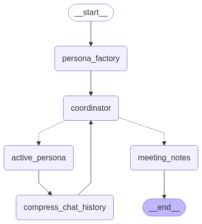
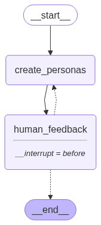
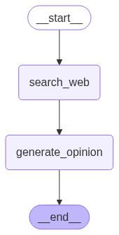

# 🧠 Agent Storm: AI Brainstorming System  

Agent Storm is a **Multi-Agent AI System** that orchestrates dynamic brainstorming sessions with a curated team of AI experts.

Rather than working with a single AI assistant, the system creates a team of specialized personas—each an LLM instance with distinct expertise and perspectives—tailored to your topic. Through coordinated discussions, you collaborate with these AI experts to thoroughly explore ideas from multiple angles and develop more robust solutions.

#### Tools & Technologies:
**LangGraph**, **LangChain**, **OpenAI API**, with a lightweight **Streamlit web interface** for human interaction.

---

## 🚀 Architecture  

The system is built with **LangGraph** to orchestrate different agents:  

- **PersonaFactoryAgent** → analyzes your topic and generates a diverse team of expert personas tailored to the discussion.  
- **PersonaAgent** → individual AI experts that research relevant information, form evidence-based opinions, and actively contribute insights.  
- **BrainstormAgent (Coordinator)** → facilitates the discussion flow, integrates user feedback, manages persona interactions, and synthesizes final recommendations.

**Key Features:**
* **Intelligent Chat Compression** → automatically summarizes conversation history when discussions grow lengthy, maintaining context while optimizing performance and reducing costs

#### High-Level Architecture Diagram

  

#### Execution flow:
1. **Persona Generation** → LLM proposes a set of personas.  
2. **Human Feedback** → user reviews and refines the personas.  
3. **Discussion Loop** → personas debate, user may interject.
4. **Chat Compression** → occasional chat history compression.
5. **Final Summary** → coordinator produces meeting notes.

**P.S:** Since only one persona can contribute at any given time, there is no need to replicate the persona agent multiple times within the graph. A more efficient design is to maintain a single agent that dynamically assumes the role of the "active persona." In practice, whenever the execution flow reaches the persona agent, it is instructed which persona it should embody at that moment — effectively allowing the agent to "wear a different hat" in each iteration.

The diagram below illustrates the architecture of the Persona Factory Agent and the Active Persona Agent.


<table width="100%">
<tr>
  <td width="50%" align="center"><h4>Persona Factory Agent</h4></td>
  <td width="50%" align="center"><h4>Active Persona Agent</h4></td>
</tr>
<tr>
  <td width="50%" align="center">
    
    
  </td>
  <td width="50%" align="center">
    
  </td>
</tr>
</table>

The **Persona Factory Agent** is responsible for generating an initial set of personas tailored to the discussion topic provided by the user. The user can then review and refine this set by providing feedback or requesting adjustments. Once finalized, these personas remain fixed for the duration of the session.

The **Persona Agent** is equipped with web search capabilities, enabling it to gather up-to-date information relevant to the ongoing discussion. With this context in hand, it leverages a language model (LLM) to generate thoughtful contributions, opinions, or responses to questions directed its way.

---

## 📦 Installation  

Clone the repo and install dependencies:  

```bash
git clone https://github.com/m-dorgham/agent-storm.git
cd agent-storm
python3 -m venv venv
source venv/bin/activate
pip install -r requirements.txt
```

---

## 🔑 API Keys  

This project requires a few API keys to run:  

- `OPENAI_API_KEY`  
- `TAVILY_API_KEY`  
- `LANGSMITH_API_KEY`  

The easiest way to provide them is by creating a `.env` file in the project root:  

```bash
# .env
OPENAI_API_KEY=your_openai_key_here
TAVILY_API_KEY=your_tavily_key_here
LANGSMITH_API_KEY=your_langsmith_key_here
```

You could also export the API keys manually in your shell if you prefer.

---

## ⚡ Usage  

### Run the web interface  

The project comes with a **Streamlit UI** (`app.py`) for easy testing:  

```bash
streamlit run agent_storming/app.py
```
This launches a simple web app where you can:

- Enter a **topic** and the number of personas to generate.
- Provide **feedback** on the generated personas.
- Participate in the **discussion loop** until typing end.
- View the **final summary** of the brainstorming session.

---

## 📜 License  

MIT License.  
